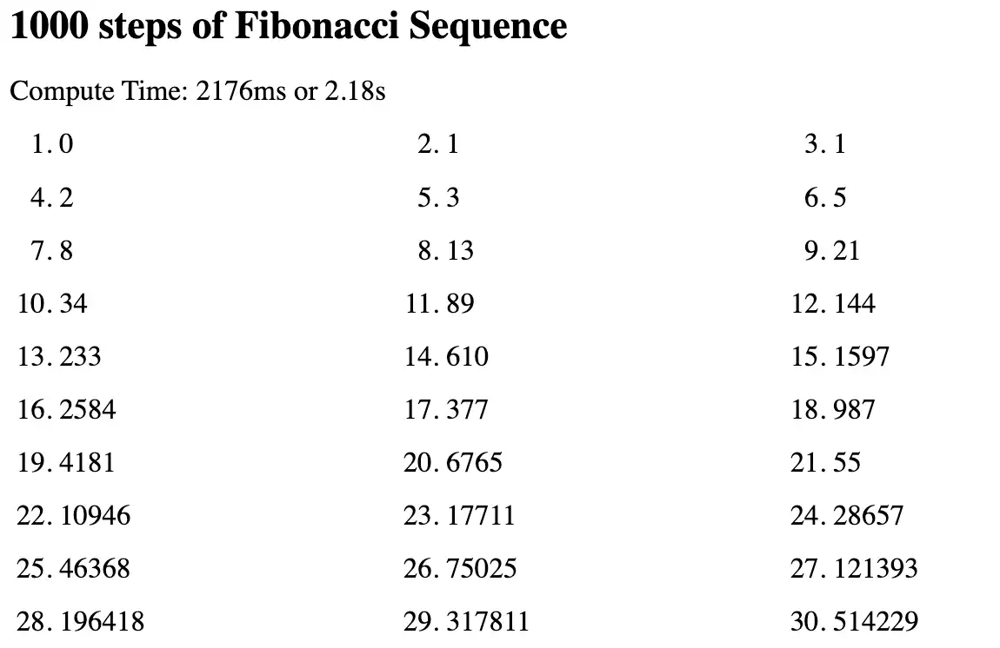

# Fibonacci Sequence with Bun Runtime

[](https://github.com/skullzarmy/fibonacci-bun-example/actions/workflows/bun-tests.yml)

## Overview

This example project demonstrates how to build a simple Fibonacci API and a web page that fetches the Fibonacci sequence from this API. The project is built using the Bun runtime, a fast and efficient JavaScript/TypeScript runtime designed for high-performance applications.

### Revolutionary Simplicity

One of the standout features of this project is its zero-dependency architecture. There are no external dependencies or initialization steps required to run the entire project. This is made possible by the Bun runtime, which provides native support for server-side operations, file handling, and more, right out of the box.

## Features

-   Fibonacci API built with TypeScript
-   Web page that fetches and displays the Fibonacci sequence
-   Server and client code optimized for performance and efficiency
-   Utilizes Bun's native file handlers and server capabilities
-   Zero external dependencies
-   Integrated Bun tests via [GitHub Actions workflow](.github/workflows/bun-tests.yml)

## Prerequisites

[Bun runtime](https://bun.sh/) installed on your machine

```bash
curl -fsSL https://bun.sh/install | bash
```

## Getting Started

Clone the Repository

```bash
git clone https://github.com/skullzarmy/fibonacci-bun-example.git
cd fibonacci-bun-example
```

## Run the Server

```bash
bun fib-server.ts
```

Or if you feel like typing more:

```bash
bun run fib-server.ts
```

This will start the server, and it should be listening for incoming HTTP requests.

## Access the Web Page

Once the server is running, you can navigate to http://localhost:3000 (or whatever port you've configured) in your web browser to see the Fibonacci sequence being printed on the page.



## Watch Mode (Optional)

If you want to run your server in watch mode, so that it restarts automatically whenever you make changes to your code, you can use the --watch flag:

```bash
bun --watch fib-server.ts
```

## Accompanying Blog Post

For a detailed explanation of this project, its architecture, and its features, check out the accompanying blog post on So Cal Tech Lab: [LINK TBD]

## Contribution

While the code is free to use and I'd be thrilled to hear if you find it useful for any projects or learning, please note that this is not a maintained project. Contributions, other than pointing out mistakes or issues, would likely not be integrated and could be a waste of effort.

## License

This project is licensed under the GNU General Public License v3.0 (GPL-3.0). For more information, please see the [LICENSE](./LICENSE) file in the repository or consult the [official GPL-3.0 documentation](https://www.gnu.org/licenses/gpl-3.0.en.html).
